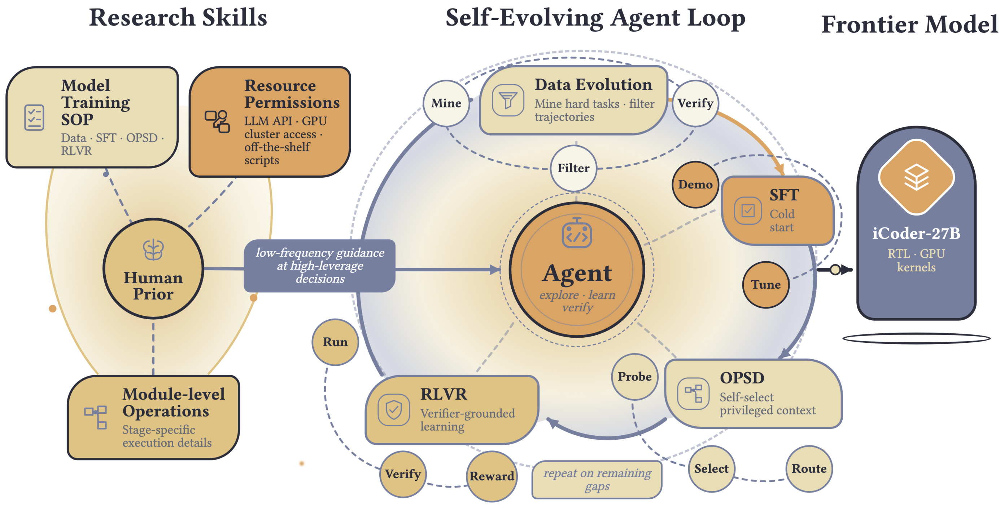

<p align="center">
  
</p>

<h3 align="center">Recursive AI-Led Development of Frontier Industrial Coding Model</h3>

<p align="center">
  <em>High-density expert priors · Low-frequency human intervention · Auditable agent-led experimentation</em>
</p>

<p align="center">
  <sub><strong>Core Contributors:</strong> Cheng Yang · Jiayang Lyu · Shangyuan Liu</sub><br>
  <sub><strong>Project Lead:</strong> Guibin Zhang &nbsp;·&nbsp; <strong>Senior Advisors:</strong> Junchi Yan · Shuicheng Yan · Weinan E</sub><br>
  <sub><strong>Corresponding Authors:</strong> Linfeng Zhang · Qibing Ren</sub>
</p>

<p align="center">
  <sub>Shanghai Jiao Tong University · National University of Singapore · DP Technology · Endless Frontier</sub>
</p>

<p align="center">
  
  
  <a href="https://huggingface.co/i-Coder"></a>
  
</p>

<p align="center">
  <a href="#overview">Overview</a> ·
  <a href="#framework">Framework</a> ·
  <a href="#repository-components">Components</a> ·
  <a href="eval_harness/README.md">Eval Harness</a> ·
  <a href="https://huggingface.co/i-Coder">Model</a> ·
  <a href="#security-and-governance">Security</a>
</p>

---

## Overview

iCoder studies a practical intermediate path toward recursive AI: how little human
involvement is sufficient for an agent to lead the development of a release-ready
industrial coding model. Human experts encode high-density operational knowledge as
**Research Skills**; within explicit resource, verification, and governance
boundaries, an agent selects experiments, executes them, diagnoses failures, and
revises a multi-stage post-training program. The resulting 27B model is
[iCoder-27B](https://huggingface.co/i-Coder).

The project targets **industrial coding**: RTL design and GPU kernel optimization,
where acceptance is determined by specialized executable toolchains and deployment
quality rather than surface similarity alone.

> [!NOTE]
> iCoder is **human-guided and agent-led**. It is not presented as fully autonomous
> recursive self-improvement. Humans define the objective, stage scaffold, trusted
> verifiers, permission boundaries, reproducibility requirements, and release
> authority; the agent controls concrete experiments and stage transitions within
> that envelope.

## Framework

<p align="center">
  
</p>

<p align="center">
  <sub>Research Skills provide an executable human prior; the agent iterates through data evolution and post-training under task-native verification.</sub>
</p>

The framework separates knowledge supplied before the loop from evidence acquired
during the loop:

| Layer | Responsibility |
|---|---|
| **Human prior** | Encode the objective, stage scaffold, trusted verifiers, permission boundaries, reproducibility requirements, and operational procedures as versioned Research Skills. |
| **Agentic experimentation** | Select data transformations, experiments, optimization objectives, reward adapters, checkpoints, and stage transitions while maintaining an auditable decision trail. |
| **Executable verification** | Ground decisions in task-native compilers, simulators, testbenches, and numerical oracles, with explicit status, failure stage, measurements, and provenance. |
| **Governance** | Keep data policy, evaluation semantics, boundary changes, external side effects, and release authority human-owned. |

### Development path

Data construction first creates a shared executable task pool. Parameter updates
then proceed through **SFT → OPSD → RLVR**:

| Stage | Role |
|---|---|
| **Data construction** | Normalize RTL and GPU-kernel seeds into a shared executable item contract, then evolve, verify, deduplicate, balance, and rescreen admitted tasks. |
| **SFT (Supervised Fine-Tuning)** | Build a capability-gap corpus from verified teacher trajectories, using task-native verdicts as the admission gate. |
| **OPSD (On-Policy Self-Distillation)** | Transfer privileged experimental context to a bare-context student through verifier-signed token credit. |
| **RLVR (Reinforcement Learning with Verifiable Rewards)** | Convert online execution outcomes into domain-aware rewards while masking trajectories without a trustworthy verdict. |

The stages form a feedback loop, not a one-way assembly line. Evaluation can return
the process to data construction, verifier work, or an earlier training decision
whenever the available evidence is insufficient. The verifier also changes roles
across stages: corpus admission in SFT, feedback construction in OPSD, and failure
diagnosis plus reward assignment in RLVR.

## Repository components

| Component | Role |
|---|---|
| [`eval_harness/`](eval_harness/) | Runs code-model evaluations across RTL and GPU-kernel benchmarks using local vLLM or an OpenAI-compatible endpoint. |
| [`research_skills/`](research_skills/) | Houses the versioned Research Skills that encode the executable human prior. Maintained by Yangcheng. |

### Evaluation harness

The harness turns generated artifacts into task-native evidence:

```text
model endpoint → candidate generation → isolated verification → structured artifacts
```

It separates generation from resource-intensive verification, records verdict and
provenance information, and keeps benchmark-specific logic behind a shared
orchestration interface. See the [complete harness guide](eval_harness/README.md).

### Research Skills

Research Skills turn recurring expert intervention into a versioned, executable,
and deliberately under-specified **process prior**. They establish safe starting
conditions and reusable procedures without prescribing the experiments or their
conclusions. Findings, negative results, and decisions remain in run-scoped research
memory rather than being folded into the prior itself.

The bundle is governed by [`research_skills/manifest.json`](research_skills/manifest.json).
Its documentation and maintenance remain with Yangcheng.

## Getting started

Clone the repository and enter the evaluation harness:

```bash
git clone https://github.com/bingreeky/iCoder.git
cd iCoder/eval_harness
```

Then follow the [toolchain, dataset, and endpoint setup](eval_harness/README.md#quick-start).

## Repository layout

```text
iCoder/
├── eval_harness/       evaluation and executable-verification infrastructure
├── research_skills/    versioned Research Skills and release manifest
└── README.md            project overview
```

## Security and governance

The evaluation harness compiles and executes model-generated code. Run it only in an
isolated, disposable environment with strict filesystem, process, resource, and
network controls. Never place personal data, model credentials, or unrelated secrets
on an evaluation host.

Research automation is constrained by explicit capabilities. New datasets, external
side effects, verifier semantics, and public releases remain human-authorized
decisions. See the harness [security guidance](eval_harness/README.md#security) for
operational details.

## Citation and release resources

Citation metadata for the evaluation harness is available in
[`eval_harness/CITATION.cff`](eval_harness/CITATION.cff). Model artifacts are
available from the [i-Coder organization on Hugging Face](https://huggingface.co/i-Coder).
The technical-report link will be added when its public page is available.

## License

The evaluation harness is released under the [MIT License](eval_harness/LICENSE).
Vendored components and benchmark datasets retain their original licenses; review
the [third-party notices](eval_harness/NOTICE) before redistribution.
