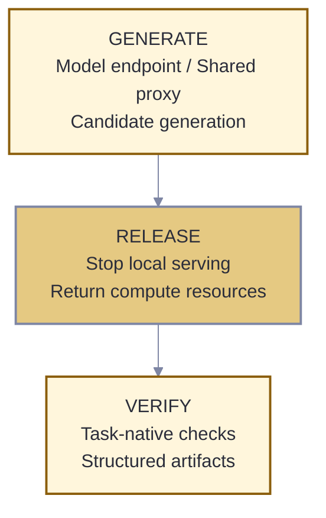

<p align="center">
  <a href="../README.md">
    
  </a>
</p>

<h1 align="center">iCoder Eval Harness</h1>

<p align="center">
  <strong>Task-native executable verification for RTL design and GPU kernel optimization.</strong>
</p>

<p align="center">
  
  
  
</p>

<p align="center">
  <a href="#quick-start">Quick start</a> ·
  <a href="#supported-benchmarks">Benchmarks</a> ·
  <a href="#outcome-contract">Outcomes</a> ·
  <a href="#configuration">Configuration</a> ·
  <a href="#security">Security</a>
</p>

---

The iCoder Eval Harness is the executable-evidence layer of the iCoder project. It
provides one workflow for generating model candidates, releasing serving resources,
running benchmark-native verification, and collecting structured artifacts with
verdict and provenance fields. It works with local vLLM deployments and external
OpenAI-compatible APIs.

> [!WARNING]
> The harness compiles and executes model-generated code. Treat every candidate as
> untrusted input and run evaluations only in an isolated, disposable environment.

## Design principles

| Principle | What it means |
|---|---|
| **Task-native verdicts** | Verdicts are produced by the benchmark's compiler, simulator, transcript comparison, self-checking testbench, programmatic assertion, golden pipeline, or numerical oracle. |
| **Explicit verdict states** | A candidate is accepted, judged and rejected, or left unverified when no trustworthy verdict is available. |
| **Provenance fields** | Artifacts record the benchmark revision, configuration, model identifier, verifier profile, and raw outputs needed to trace a verdict. |
| **Endpoint neutral** | The same runners can target a local vLLM deployment or an external OpenAI-compatible endpoint. |
| **Resource aware** | Generation and GPU-heavy verification are separated so serving resources can be released before scoring. |
| **Fail closed** | Infrastructure classification is accepted only from explicit harness-controlled fields; candidate output is treated as untrusted. |

## Execution model



Generation-only benchmarks finish while the endpoint is available. Benchmarks that
need compilation, simulation, or GPU execution continue after the local serving
engine has stopped. External API mode skips local model serving while preserving the
same downstream runners and artifact layout.

## Outcome contract

Verifier adapters emit a common evidence record:

| Field | Content |
|---|---|
| **Status** | `pass`, `judged failure`, or `unverified` |
| **Failure stage** | The trusted execution stage that produced or prevented a verdict |
| **Measurements** | Task-grounded evidence such as mismatch data, execution signals, or performance measurements |
| **Provenance** | Verifier, toolchain, payload, configuration, and artifact identity needed to trace the verdict |

The status preserves the difference between model behavior and infrastructure
behavior:

| Outcome | Meaning |
|---|---|
| **Pass** | The task-native oracle explicitly accepts the generated artifact. |
| **Judged failure** | The candidate reached a valid oracle and failed its contract. |
| **Unverified** | A harness-recognized infrastructure failure prevented a trustworthy verdict. |

Candidate source, compiler output, runtime text, tracebacks, and process exit codes
are treated as untrusted. The classifier accepts infrastructure status only from
explicit fields set by harness-controlled logic. See
[`verify/README.md`](verify/README.md) for the classification boundary and module
map.

## Supported benchmarks

| Domain | Benchmarks | Native verification |
|---|---|---|
| RTL design | VerilogEval, RTLLM, ArchXBench, RealBench-Module, CVDP | compilation, simulation, transcript comparison, assertions, golden pipelines, or task testbenches |
| GPU kernels | KernelBench, TritonBench-G, TritonBench-T | compilation and numerical comparison with benchmark references |

Benchmark membership, runner modes, sampling settings, and profiles are defined in
[`benches/registry.sh`](benches/registry.sh). Upstream datasets are installed
separately and retain their own licenses.

## Security

Model output can attempt to read files, start processes, consume resources, access
the network, or exploit compiler and runtime vulnerabilities. Timeouts are useful,
but they are not a sandbox boundary.

For every evaluation environment:

- use a disposable container or dedicated machine with no personal data or secrets;
- mount the repository, datasets, and toolchains read-only wherever possible;
- run as a non-root user and never use a privileged container;
- drop unnecessary capabilities and apply memory, CPU, process, and time limits;
- restrict network access to the model endpoint during generation, then disable it
  during offline verification when possible;
- keep API credentials outside the repository and command line.

The verifier uses separate process groups, resource limits, timeouts, and temporary
working directories. These controls provide defense in depth; they do not replace
host or container isolation.

## Prerequisites

The complete suite targets Linux. Install only the components needed by the selected
benchmarks:

| Component | Used for |
|---|---|
| Bash, Python, Git, and curl | orchestration and dataset setup |
| Icarus Verilog | VerilogEval, RTLLM, ArchXBench, and CVDP |
| Verilator and Yosys | RealBench |
| NVIDIA CUDA, PyTorch, and Triton | KernelBench and TritonBench |
| vLLM | optional local model serving |

See [`requirements.txt`](requirements.txt) for evaluation-side Python packages.
GPU-specific packages are intentionally not pinned there; install versions compatible
with the host driver and CUDA runtime. The included [`Dockerfile`](Dockerfile)
provides a starting environment but does not bundle benchmark datasets.

## Quick start

### Clone

```bash
git clone https://github.com/bingreeky/iCoder.git
cd iCoder/eval_harness
```

### Prepare the toolchain and datasets

```bash
bash setup/setup_toolchain.sh /opt/eval-toolchain
bash setup/setup_datasets.sh ./benchmarks
```

The setup scripts print the paths required by the local configuration. Some datasets
may require separate access or setup; consult their upstream projects and licenses.

### Configure the host

```bash
cp config.local.sh.example config.local.sh
```

Edit `config.local.sh` with local dataset paths, interpreter paths, toolchain paths,
and model-endpoint settings. The file is ignored by Git and must never be committed.

### Run against an external endpoint

```bash
bash run_all.sh --api "$EXTERNAL_API_URL" <served_name>
```

### Run a local vLLM model

```bash
bash run_all.sh <model_path> <served_name> [max_model_len]
```

### Summarize artifacts

```bash
bash summarize.sh <served_name>
bash summarize.sh --table <served_name>
```

Summaries describe the current run only. The repository does not ship model rankings
or reference scores.

## Profiles and recovery

Run a registered subset:

```bash
bash run_all.sh --api --profile <profile> "$EXTERNAL_API_URL" <served_name>
```

Resume or isolate an execution stage:

```bash
bash run_all.sh --no-engine <served_name>
bash run_all.sh --down-only <served_name>
bash run_all.sh --group up <served_name>
bash run_all.sh --group down <served_name>
```

Profiles map to `BENCHES_UP_<NAME>` and `BENCHES_DOWN_<NAME>` arrays in the
registry.

## Configuration

Portable defaults live in [`config.sh`](config.sh); host-specific overrides belong
in the ignored `config.local.sh` file.

| Setting | Purpose |
|---|---|
| `CODERBENCH_ROOT` | root directory for benchmark checkouts |
| `RESULTS_DIR` | generated artifacts and summaries |
| `N_GPU` | GPU discovery override and verification sharding |
| `VLLM_PY` | Python interpreter used for local vLLM serving |
| `SYS_PY` | Python interpreter used by lightweight runners |
| `KERNELBENCH_PY` | environment used for KernelBench evaluation |
| `EXTERNAL_API_URL` | external OpenAI-compatible endpoint |
| `EXTERNAL_API_KEY` | endpoint credential; keep it out of logs and Git |
| `API_SERVED_NAME` | model identifier forwarded to the endpoint |

Dataset-specific roots and optional settings are documented in
[`config.local.sh.example`](config.local.sh.example).

## Repository map

```text
eval_harness/
├── benches/       benchmark runners and registry
├── docs/assets/   project artwork used by the public documentation
├── engine/        local serving and API proxy
├── expand/        candidate-generation adapters used by TritonBench flows
├── ext/           vendored upstream components
├── lib/           shared shell helpers
├── scripts/       local maintenance and rescoring utilities
├── setup/         toolchain and dataset bootstrap
├── verify/        verification and failure classification
├── config.sh      portable defaults
├── run_all.sh     top-level orchestration
└── summarize.sh   result aggregation
```

Local utilities are documented in [`scripts/README.md`](scripts/README.md).

## Reproducibility

Keep the following with any published evaluation:

- benchmark and harness revisions;
- model and endpoint identifiers;
- local configuration with credentials removed;
- dependency and verifier-profile versions;
- raw generation and verification artifacts;
- the exact summary command used for aggregation.

Do not compare summaries produced with different benchmark revisions or verifier
profiles as if they were directly equivalent.

## Extending the harness

To add a benchmark:

1. create a runner under `benches/`;
2. register its generation or verification stage in `benches/registry.sh`;
3. adapt its native oracle to the shared outcome contract where needed;
4. document required datasets, toolchains, and harness-controlled infrastructure
   signals.

## License and attribution

The harness is released under the [MIT License](LICENSE). Vendored code and external
benchmarks retain their original licenses; see [`NOTICE`](NOTICE) before
redistributing a combined environment.

Citation metadata is available in [`CITATION.cff`](CITATION.cff).

<p align="center"><a href="../README.md">Back to the iCoder project</a></p>
